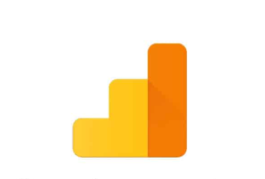
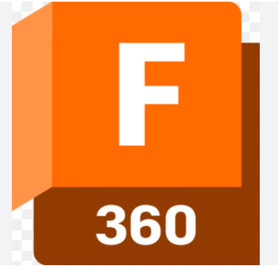

# PORTFOLIO
```
<!DOCTYPE html>
<html lang="en">
<head>
    <meta charset="UTF-8">
    <meta name="viewport" content="width=device-width, initial-scale=1.0">
    <title>Portfolio</title>
    <style>
        /* General Styles */
        body {
            font-family: Arial, sans-serif;
            background-color: #f4f4f4;
            text-align: center;
            margin: 0;
            padding: 0;
        }
        .container {
            width: 80%;
            margin: auto;
            padding: 20px;
        }

        /* Profile Section */
        .profile {
            margin-top: 20px;
        }
        .profile img {
            width: 150px;
            height: 150px;
            border-radius: 50%;
            object-fit: cover;
            border: 4px solid #333;
        }
        .profile h1 {
            font-size: 24px;
            margin-top: 10px;
        }
        .profile h3 {
            font-size: 18px;
            color: gray;
        }

        /* About Section */
        .about {
            background: white;
            padding: 20px;
            margin: 20px 0;
            border-radius: 10px;
            box-shadow: 0 4px 10px rgba(0, 0, 0, 0.1);
        }

        /* Skills & Tools */
        .section-title {
            font-size: 22px;
            margin-bottom: 15px;
            text-transform: uppercase;
            font-weight: bold;
        }
        .grid-container {
            display: flex;
            flex-wrap: wrap;
            justify-content: center;
            gap: 20px;
            margin-top: 10px;
        }
        .grid-item {
            width: 120px;
            text-align: center;
        }
        .grid-item img {
            width: 60px;
            height: 60px;
            object-fit: contain;
        }
        .grid-item p {
            margin-top: 5px;
            font-size: 14px;
        }

        /* Footer */
        footer {
            background: #333;
            color: white;
            padding: 15px;
            margin-top: 20px;
            font-size: 14px;
        }
    </style>
</head>
<body>

    <div class="container">

        <!-- Profile Section -->
        <div class="profile">
            
            <h1>SANJAY G</h1>
            <h3>B.Tech(Artificial Intellengence and Data Science)</h3>
        </div>

        <!-- About Section -->
        <div class="about">
            <h2>About Me</h2>
            <p>NAME:SANJAY 
            </p><br>
        </div>

        <!-- Skills Section -->
        <div class="about">
            <h2 class="section-title">Skills</h2>
            <div class="grid-container">
                <div class="grid-item">
                    
                    <p>Database Management</p>
                </div>
                <div class="grid-item">
                    
                    <p>TensorFlow</p>
                </div>
                <div class="grid-item">
                    
                    <p>Neural Network</p>
                </div>
                <div class="grid-item">
                    
                    <p>Data Manipulation</p>
                </div>
                <div class="grid-item">
                    
                    <p>Data Analysis</p>
                </div>
                <div class="grid-item">
                    
                    <p>Data Visualization</p>
                </div>
            </div>
        </div>

        <!-- Tools Section -->
        <div class="about">
            <h2 class="section-title">Tools</h2>
            <div class="grid-container">
                <div class="grid-item">
                    
                    <p>Power BI</p>
                </div>
                <div class="grid-item">
                    
                    <p>Tableau</p>
                </div>
                <div class="grid-item">
                    
                    <p>MySQL</p>
                </div>
                <div class="grid-item">
                    
                    <p>MongoDB</p>
                </div>
                <div class="grid-item">
                    
                    <p>Google Analytics</p>
                </div>
                <div class="grid-item">
                    
                    <p>Fusion 360</p>
                </div>
            </div>
        </div>

    </div>

    <!-- Footer -->
    <footer>
        <p>&copy; 2024 Your Portfolio. All rights reserved.</p>
    </footer>

</body>
</html>

```
